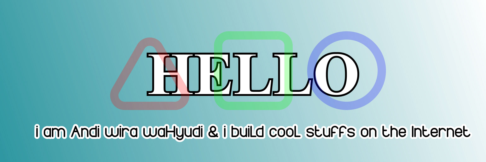

### Hi there 👋

<a href='https://anwiwah.my.id'>
  <!-- https://www.readmebox.com/ -->
  
</a>

Hi, I am Andi wira waHyudi a passionate self-taught full stack web developer and a freelancer from Indonesia. I have a passion for web design and love to create things for web and mobile devices.

<!--
**AnwiwaH/anwiwah** is a ✨ _special_ ✨ repository because its `README.md` (this file) appears on your GitHub profile.

Here are some ideas to get you started:

- 🔭 I’m currently working on ...
- 🌱 I’m currently learning ...
- 👯 I’m looking to collaborate on ...
- 🤔 I’m looking for help with ...
- 💬 Ask me about ...
- 📫 How to reach me: ...
- 😄 Pronouns: ...
- ⚡ Fun fact: ...
-->

- 🌱 I’m currently learning **React**
- 👨‍💻 All of my projects are available at [https://github.com/anwiwah](https://github.com/anwiwah)
- 💬 Ask me about **Java Script**
- 📫 How to reach me **anwiwah@gmail.com**

**languages and tools:**  

<code></code>
<code></code>
<code></code>
<code></code>
<code></code>
<code></code>
<code></code>
<code></code>
<code></code>
<code></code>
<code></code>
<code></code>

 
 
 

## 📊 My Stats
|Github Stats|Languages|
|---|---|
|||

---

### 📕 The Roadmap

<!-- ROADMAP:START -->
- [Frontend Developer - Step by step guide to becoming a modern frontend developer in 2021](https://roadmap.sh/frontend)
- [Backend Developer - Step by step guide to becoming a modern backend developer in 2021](https://roadmap.sh/backend)
- [DevOps Roadmap - Step by step guide for DevOps, SRE or any other Operations Role in 2021](https://roadmap.sh/devops)
<!-- ROADMAP:END -->

➡️ [more Roadmap...](https://roadmap.sh/roadmaps)

---

### 📕 Developer Benefit Roadmap

➡️ [Network - Basic](#)
<!-- ROADMAP:START -->
- [Github](#)
- [Codepen](#)
- [Coder Wall](#)
- [Stack Exchange](#)
- [Geeklist](#)
- [CSS Community](#)
- [Code Ranch](#)
<!-- ROADMAP:END -->

➡️ [News - Tecnology](#)
<!-- ROADMAP:START -->
- [...](#)
<!-- ROADMAP:END -->

➡️ [Tutorial - Learning](#)
<!-- ROADMAP:START -->
- [...](#)
<!-- ROADMAP:END -->

➡️ [Practice - Challenges](#)
<!-- ROADMAP:START -->
- [...](#)
<!-- ROADMAP:END -->

➡️ [Jobs - Chances](#)
<!-- ROADMAP:START -->
- [...](#)
<!-- ROADMAP:END -->

---

<picture>
  <source media="(prefers-color-scheme: dark)" srcset="github-snake-dark.svg" />
  <source media="(prefers-color-scheme: light)" srcset="github-snake.svg" />
  
</picture>
